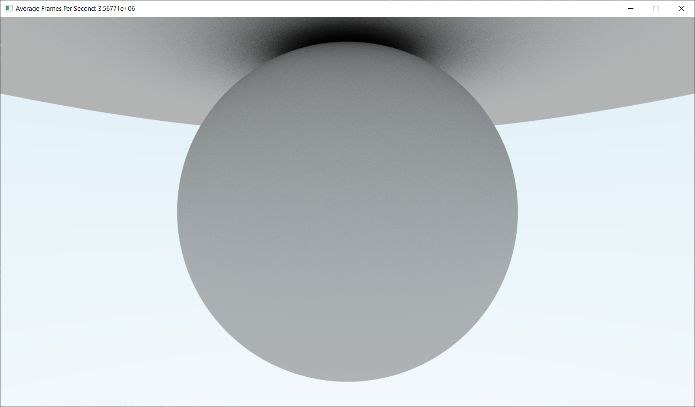
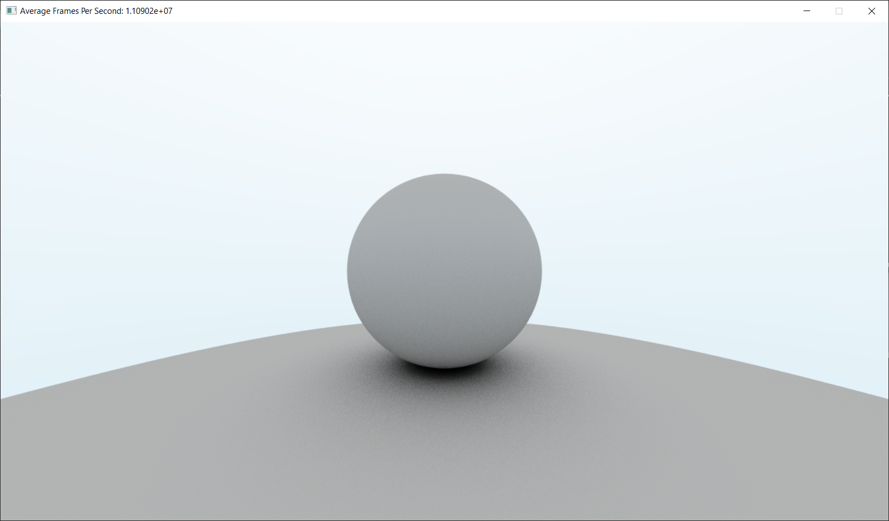

# Raytracing in One Week

Learning how to do Raytracing from Peter Sherley's Raytracing in One Week https://raytracing.github.io/books/RayTracingInOneWeekend.html . In the middle of the program development, I found out the program has significantly slower, so I port it to NVIDIA CUDA.

The program is developed using GTX 1060 Ti.

## Progress

